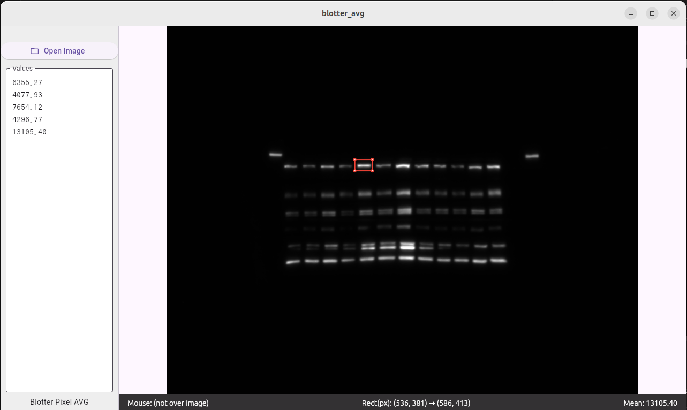

## Blotter AVG

Blotter AVG is a lightweight, cross-platform desktop tool inspired by ImageJ, designed for quickly loading and analyzing 16-bit TIFF images (e.g., Western blot data). It enables users to select and drag rectangles over images to compute the average (mean) pixel value, streamlining quantitative analysis for scientific data.

## Features

- Open and View: Easily open .tif, .tiff, .png, or .jpg images via drag-and-drop or the "Open Image" button.

- 16-bit TIFF Support: Optimized for scientific images common in bioimaging, such as Western blots.

- Region Analysis:
	- Draw and move rectangles to specify areas of interest.

	- Drag corners (pivots) to resize regions.

	- Use arrow keys to nudge the rectangle pixel by pixel for precision.

	- Press P to instantly calculate and append the mean pixel value to the dashboard.

- Dashboard Window: View and accumulate result values; copy out for reporting and further analysis.

- Simple & Fast: Minimal UI, focused on essential quantitation and data export.

## Usage

1. Open Your Image: Drag & drop an image file, or use the "Open Image" button.

2. Draw a Rectangle: Click and drag on the image to select a region.

3. Adjust Region: Move or resize the selection by dragging corners or using the arrow keys.

4. Get the Mean: Press P on your keyboard; the mean pixel value of the selected region is displayed and recorded in the dashboard.

5. Export Results: Copy the results from the dashboard for pasting into your analysis pipeline.

Why Blotter AVG?

Blotter AVG is ideal for fast, reproducible measurements of pixel intensities, commonly needed in bioscience imaging workflows, such as quantifying Western blot bands. It’s simple, script-free, and focused on one high-precision task.

---
Note:

Blotter AVG currently supports only 16-bit TIFF greyscale images.